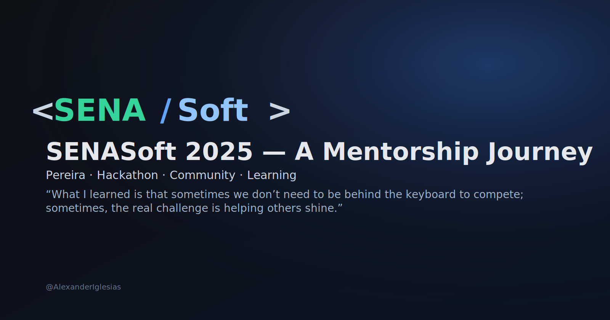

  

  
  
  
  
  

> 🇪🇸 Lee esto en español: [Versión en Español](README.md)

> 🇬🇧 You’re viewing the English version.

# My Experience at SENASoft 2025

> *“What I learned is that sometimes we don’t need to be behind the keyboard to compete;  
> sometimes, the real challenge is helping others shine.”*

---

## 🌟 Overview

SENASoft 2025 took place last week in Pereira, Colombia. For those who are not familiar with it, it is a hackathon that brings together students from across the country to compete in categories such as:

- Free Development  
- Digital Women  
- Cyber Security  
- Integral Development  
- Networks  

Among many others.

This year, my participation was not what I expected… but it ended up becoming one of the most rewarding experiences of my professional life.

Originally, I was going to compete like any other participant, ready to give my all in the arena. But fate had different plans for me.

I received the news with little surprise. I knew this could happen — but I didn’t expect it to happen while I was already there, standing in the arena, ready to jump into battle.

My first reaction was resignation. I told the organizers that if they felt more comfortable with me stepping aside, I would do it. But then, I received a twist in the story: they wanted me to stay — not as a competitor, but as a support mentor.

Not what I expected, but definitely a challenge that opened my mind.

My role was simple: support participants with basic issues in the arena — report internet problems, communicate with the organizers, etc. Honestly, it felt boring at the beginning… but that was about to change.

---

## Day 1 — Analysis and Design

Some participants asked why I wasn’t competing. I responded that it was a decision from the organization, and I would be helping instead.

But as minutes went by, something changed inside me.

I’ve always enjoyed teaching technology and software development. So every question coming from the students, I took it with a smile — trying to guide them, without giving away the full solution, and even researching answers on the go to avoid misguiding them.

The first day was exhausting but fulfilling. It focused on Analysis and Software Design — a stage that many devs dislike because of the amount of documentation: user stories, functional requirements, diagrams, etc.

I used a simple analogy:

> “Imagine building a house. The architect starts with basic blueprints: rooms, stairs, kitchen, bathrooms… At that point, they’re not deciding wall colors or the facade design. They focus on foundations. Software analysis is exactly that — laying the ground so the app doesn’t collapse later.”

Some understood it right away, others… not so much (time pressure has that effect 😅).

I won’t lie: I felt a bit jealous for not being in the arena developing.  
But every *thank you* restored something inside me — a feeling I really missed.

---

## Day 2 — Code, AI, and Panicked Faces

Day two: the most exciting one — time to code!  

I started hearing familiar words:

- “It doesn’t compile”
- “The API key isn’t working”
- “It won’t run”
- “How do I connect front and back?”

I also discovered their favorite stack: **n8n, Supabase, Railway, and Vercel**.  
No Java, Python, PHP… not even much JavaScript.  
Just… drag and drop everywhere.

It made me feel a bit old-school 🦖 but also worried:  
are we teaching devs to rely too much on low-code?

Some real cases:

A team was fetching 100+ records and iterating them multiple times with the LLM — extremely inefficient. Their fix (proposed by AI): “add a cache”. Not wrong… but definitely not *the* solution.

Another team using Java couldn’t compile because…  
they used Lombok **without** the plugin installed 😅  
Then missing annotations.  
Why pick tools that slow you down in a timed competition?

What really concerned me:

> New devs **don’t read**.

Missing instructions  
Ignoring console logs  
Not understanding errors  

Added to a dangerous trend:  
> AI is becoming a crutch, not a tool.

And the concept of MVP… gone.  
They wanted to deliver a full product on day 1.

That day left me thinking a lot.

---

## Day 3 — Deploy, Pitch, and Heart

Deploy day. Pitch day. Panic day 😅

I expected deployments on AWS, GCP, or Azure.  
Reality: only **2 out of 14** deployed to a real cloud provider.

Most used Supabase, Vercel, or Railway.

I asked: *“Why?”*

> “It’s easier”  
> “That’s what we learned”

Not necessarily wrong — but lacking intention.

Some deployed apps lost session on refresh (login → F5 → restart).  
Maybe misconfiguration… or platform behavior. Interesting case.

For pitching, I advised:

> “Present like you were explaining it to your grandparents.  
> Talk about the problem, not the tech buzzwords.”

Some listened.  
Some didn’t and went full “LLM + Cloud + AI…” 🤯

Fortunately, a pitch expert came to help. Bless them 🙏  
Because I’m definitely not the pitch guy 😂

Despite exhaustion, I saw fire in their eyes:  
nerves, pride, fear, confidence… everything at once.

They were not the same students from day 1.  
But many didn’t realize how much they had grown.

They survived:

- 3 days under pressure  
- 3 days of learning  
- 3 days pushing their limits  

Only a few truly understood that.

---

## Final Thoughts

I left the arena with my heart full — with gratitude, with joy, with hope.

Most importantly, I left wanting to keep helping these young talents,  
to contribute to shaping the future of this country’s tech community.

That spark inside me tells me…  
this was just the beginning.

> **“What I learned is that sometimes we don’t need to be behind the keyboard to compete;  
> sometimes, the real challenge is helping others shine.”**