  

  
  
  
  
  

> 🌎 Read this in English: [English Version](README.en.md)

> 🇪🇸 Estás viendo la versión en español.

# 🧑‍💻 SENASoft 2025 — Mi experiencia desde la arena

> *“Lo que aprendí es que a veces no debemos estar detrás del teclado para competir;  
> a veces, el verdadero reto es acompañar a otros a brillar.”*

---

## 🌟 Descripción

Este repositorio nace de una experiencia muy especial vivida durante **SENASoft 2025**, una hackathon que reúne a aprendices SENA de todo el país para poner a prueba sus habilidades en tecnología, desarrollo, innovación y trabajo en equipo.

Mi intención con este espacio es compartir una historia que va más allá del código: un relato sobre **adaptarse a los cambios**, **apoyar a otros**, y **reconocer que enseñar también es aprender**.

---

## 📖 Mi experiencia en SENASoft 2025

La semana pasada se llevó a cabo SENASoft 2025 en la ciudad de Pereira. Para los que no conocen lo que es, puedo decir en palabras sencillas que es una hackathon que reúne distintas categorías como:

- Desarrollo Libre  
- Mujeres Digitales  
- Ciber Seguridad  
- Desarrollo Integral  
- Redes  

Entre muchas otras.

Para esta edición, mi participación no fue como lo esperaba, pero fue una de las experiencias más enriquecedoras que he podido tener a nivel profesional.

Cuando digo que no fue lo que esperaba, es porque inicialmente iba a participar como un aprendiz más, dejando todo en la arena, desarrollando el reto seleccionado por la organización. Pero por azares del destino, mi rol en la competición cambió.

La noticia la recibí con poco asombro; aunque sabía que eso podía pasar, no esperaba que sucediera… o al menos no estando allá, en la arena, listo para dejarlo todo en el campo de batalla.

Mi primera reacción fue de resignación. Le dije a los organizadores que estaba bien, que si se sentían más tranquilos con que diera un paso al costado, lo iba a hacer. Pero luego recibí una noticia que no esperaba: querían que siguiera en la arena, pero no como participante más sino como apoyo. Esto me asombró y me abrió la mente a este nuevo reto.

Mi rol de apoyo era básicamente solucionar temas sencillos que se presentaran en la arena: reportar problemas con el internet, ser un enlace entre los participantes y la organización, temas muy básicos. Sí, me parecía un poco aburrido… pero era lo que había.

---

### Día 1 — Análisis y diseño

Inició la competencia. Algunos me preguntaban con asombro por qué no estaba participando; yo me limitaba a responder que por decisión de la organización iba a estar como apoyo.

Pero a medida que avanzaban los minutos, algo en mi interior fue cambiando. Siempre me ha gustado enseñar sobre tecnología y desarrollo de software. Y estando allá, cada pregunta que salía de los chicos la recibía con gusto, tratando de responderla sin dar demasiado detalle (no me era permitido), investigando para no dar una respuesta equivocada.

El día uno fue agotador, pero gratificante. Estuvo centrado en el análisis y diseño del software; una etapa crítica, pero que entiendo que a muchos devs no les agrada por la cantidad de documentación: historias de usuario, requerimientos funcionales, diagramas, etc. No suele ser muy agradable.

En ese momento les dije algo como:

> “Imaginen que van a construir una casa. El arquitecto inicia con los planos básicos: habitaciones, escaleras, cocina, baños… En ese punto aún no ha pensado en el color de las paredes ni en la fachada, solo está plasmando lo necesario para que la casa sea sólida. El análisis y diseño es ese plano inicial: aún no definimos cómo se verá nuestra app; solo estamos poniendo los cimientos para que tenga todo lo necesario y no tengamos que cambiar cosas más adelante.”

Algunos captaron muy bien la analogía; otros no, lo cual es normal. Con la presión del tiempo y las entregas, cada equipo trataba de organizarse lo mejor posible… y ahí estaba yo, hablando de planos y roadmaps, tratando de explicar la visión agéntica de la aplicación (debido a que cada app debía integrar LLM, MCP y, si era posible, A2A).

No puedo negar que sentí cierta envidia al no poder estar sentado en la arena resolviendo el reto, pero a la vez sentía algo muy lindo cada vez que respondía una pregunta y me daban las gracias. Algo que hacía mucho no sentía.

---

### Día 2 — Código, IA y rostros de preocupación

Llegó el día dos. Para muchos, el más emocionante: había que codificar. Algunos decidieron ir con soluciones simples (“¿para qué reinventar la rueda?”), otros con soluciones más complejas.

El tiempo avanzaba y cada vez veía más caras de preocupación:

- “No compila.”  
- “Mi proyecto no corre.”  
- “No puedo integrar el back con el front.”  
- “El API Key para el LLM no funciona.”  
- “¿Debo abrir una cuenta de AWS para usar este API KEY?”

Ahí estaba yo, aprendiendo cosas nuevas también. Descubrí que el stack favorito de muchos era **n8n, Supabase, Railway y Vercel**. Herramientas desconocidas para mí. Yo esperaba ver más Java, Python, PHP, JS… No esperaba encontrarme con entornos gráficos modernos donde ellos hacían el deploy de sus aplicaciones y conectaban todo arrastrando bloques. 

Esto me hizo sentir un poco dinosaurio 🦖 pero también me generó preocupación al ver cómo se están acostumbrando a crear apps sin codificar, solo uniendo líneas en una UI.

Hubo casos puntuales que recuerdo bien. Por ejemplo, un equipo tenía un query que traía unos 100 resultados y luego esos resultados eran iterados uno a uno, haciendo todo muy ineficiente, especialmente si el LLM debía procesarlo varias veces. Les recomendé apoyarse en IA para encontrar una mejor solución, pero el consejo salió regular: volvieron diciendo que iban a implementar una capa de caché. Les dije que el caché estaba bien, pero que no era la verdadera solución del problema. Les faltaba una tabla que diera granularidad a los datos. Luego de un tiempo entendieron.

Otro caso fue con un equipo que usó Java. Mi lenguaje. Llevaban bastante tiempo sin poder compilar. Me acerqué: usaban Lombok, pero **sin** tener instalado el plugin. Una vez instalado, faltaban anotaciones básicas. En ese punto pensé: ¿por qué elegir una librería que, si no conoces, te hará perder tiempo valioso en una competencia contra reloj?

Lo que más me dejó preocupado del día fue:

> Los nuevos devs **no leen**.

Pasarse por alto instrucciones.  
No revisar los logs.  
No entender la consola.  

Y a eso sumarle **abuso de la IA**:  
Deja de ser una herramienta para convertirse en el solucionador de TODO.

Además, el concepto de **MVP** se perdió completamente.  
El MVP para ellos era casi un producto terminado, pese a que en las instrucciones se hablaba claramente de elegir solo dos o tres funcionalidades clave.

Me fui con esas preocupaciones en mente.

---

### Día 3 — Deploy, pitch y puro corazón

El último día arrancó con algunos inconvenientes que no vienen al caso. Los chicos estaban pensando en el deploy y en preparar el pitch para el jurado.

Yo esperaba que hicieran deploy en AWS, GCP o Azure… pero sorpresa: solo **2 de los 14 equipos** lo hicieron en la nube. El resto usó Supabase, Vercel o Railway.

Desde mi mentalidad de dinosaurio, pregunté por qué; ninguno me dio una razón fuerte:  
“Así nos lo enseñaron”, “Es más fácil”.

Noté que las apps “desplegadas” en Vercel tenían un problema: la sesión no se mantenía. Hacías login, pasabas a otra pantalla y al presionar F5… vuelta al inicio. No sé si les faltaba algo o si es así el comportamiento por defecto, pero me llamó la atención.

Para el pitch les aconsejé:

> “Piensen que este producto se lo van a vender a sus abuelos. Ellos no saben de tecnología. No hablen de LLM, MCP, deploy, cloud… a menos que el jurado les pregunte. Hablen del problema que resuelven.”

Algunos siguieron el consejo, otros no.

Ese día fue un poco más tranquilo para mí porque alguien del jurado experto en esos temas los apoyó (gracias al cielo, porque yo soy pésimo para hablar en público 😅).

El día fue corto. Los chicos (no todos) pudieron desplegar sus apps y revisar todo antes de pasar con el jurado. Yo estaba agotado y estoy seguro de que ellos también. Pero podía ver fuego en sus miradas: incertidumbre, nervios, seguridad… todos eran un mundo diferente.

No eran los mismos que habían pisado la arena el primer día.  
Pero muchos no lo sabían.  

Habían sobrevivido a tres días de inmensa presión.  
Tres días de exigirse al máximo.  
Tres días para aprender y ejecutar muchas cosas.  

Y solo unos pocos se dieron cuenta de ello.

---

## 💬 Cierre

Me fui de la arena con el corazón recogido, con palabras de agradecimiento y con recuerdos que perdurarán en mi mente. Pero, sobre todo, me fui con ganas de seguir apoyando a estos jóvenes talentos, de poner mi granito de arena para ayudar a pulir estos diamantes en bruto que tenemos en todo el territorio nacional.

Esa chispa que se encendió en mí me dice que este fue solo el inicio.  
Y espero poder aportar al desarrollo del futuro del país.

> **“Lo que aprendí es que a veces no debemos estar detrás del teclado para competir;  
> a veces, el verdadero reto es acompañar a otros a brillar.”**
